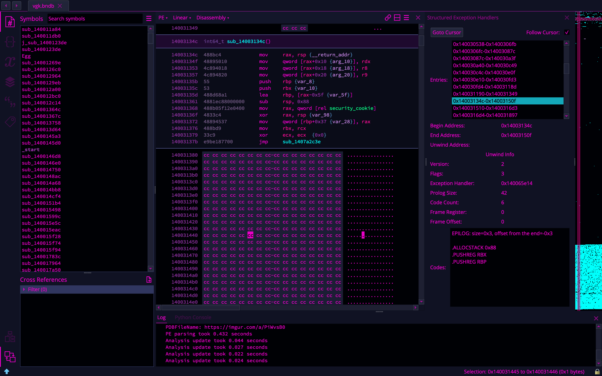

# SEH Helper

Author: **EliseZeroTwo**

_A Binary Ninja helper for exploring structured exception handlers in PEs_

## Description:

This plugin provides a UI helper for exploring structured exception handlers in PEs. It provides a feature to view all entries, view the entry at the cursor, or follow the cursor displaying the entry at the cursor constantly.

## License

This plugin is released under an [MIT license](./license).

